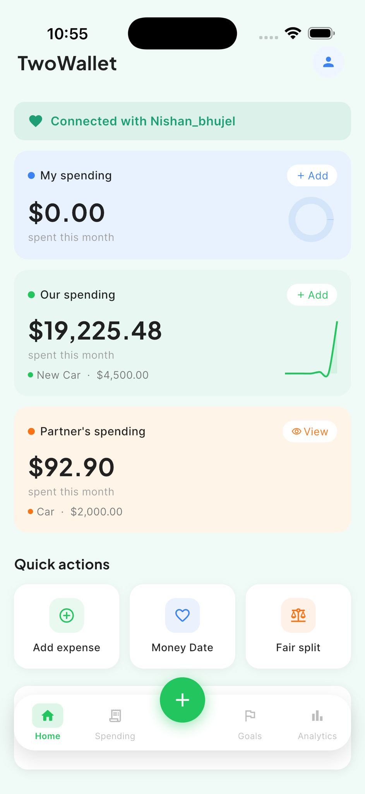

# TwoWallet

A Flutter couples-finance app designed to help partners manage shared expenses, set goals together, and stay aligned on money without the conflict. Currently live on Google Play internal testing and iOS TestFlight.

## What it does

TwoWallet uses a three-bucket model (Mine / Ours / Theirs) to track personal and shared finances between couples. It calculates fair splits on shared expenses, tracks individual and joint goals, and includes a weekly "Money Date" feature powered by the Anthropic Claude API that prompts reflective conversations about spending.

## Tech Stack

**Frontend:**
- Flutter + Dart
- Riverpod (state management)
- Go Router (navigation)

**Backend:**
- Supabase (Postgres database with Row-Level Security)
- Supabase Edge Functions
- Supabase Auth

**Integrations:**
- RevenueCat (subscription management)
- PostHog (analytics and feature flags)
- Anthropic Claude API (AI-powered Money Date feature)

## Key Technical Decisions

**Supabase over Firebase:** I chose Supabase for Postgres-level data modeling (relational integrity, numeric types, RLS policies) rather than a document store. The trade-off was building my own RLS policies and auth triggers, but it gave me precise control over the data layer that would have been painful to retrofit later.

**Riverpod over Provider:** Steeper learning curve and more boilerplate, but I wanted compile-time dependency injection and better testability as the codebase grew. For a solo project I plan to scale features on, I prioritized long-term maintainability over initial speed.

**Plain Dart classes over Freezed:** I started with Freezed for immutability and `copyWith`, but hit persistent friction with Postgres `numeric` columns arriving as `String` at runtime. Freezed's strict typing made the cast noisy to handle at every boundary. I switched to plain Dart classes with explicit `double.parse(json['field'].toString())` parsing. Lost some ergonomics, gained clean control over the data boundary.

**RevenueCat over Stripe for mobile subscriptions:** Stripe's mobile flow is painful. RevenueCat handles receipt validation, subscription state, and cross-platform sync. For a solo developer, the abstraction saved weeks.

**PostHog from day one:** I instrumented the onboarding funnel before launching, not after. I wanted to see where drop-offs were rather than guessing after the fact.

## What I Learned

The biggest lesson came from a production bug where partner-linked queries silently returned empty result sets. Root cause: an RLS policy referenced a helper function without a schema prefix (`is_partner_of` vs `public.is_partner_of`). Postgres couldn't resolve it under the authenticated role's security context, so the policy silently failed closed. No error, just empty data.

The investigation taught me that AI-generated security code needs adversarial testing across multiple user contexts (owner, non-owner, unauthenticated), not just functional testing. I now run RLS policies against at least three session contexts before shipping.

## What I'd Change

If I rebuilt the backend today, I'd extract the relationship and partner logic into Supabase Edge Functions instead of letting it leak across client repositories. As the feature surface grew, that became sprawl. A clean Edge Function boundary would have kept the separation clearer.

## Links

- **Live on Play Store (internal testing):** Contact for access
- **Live on TestFlight:** Contact for access
- **Company:** Built under SoftServe Lab
