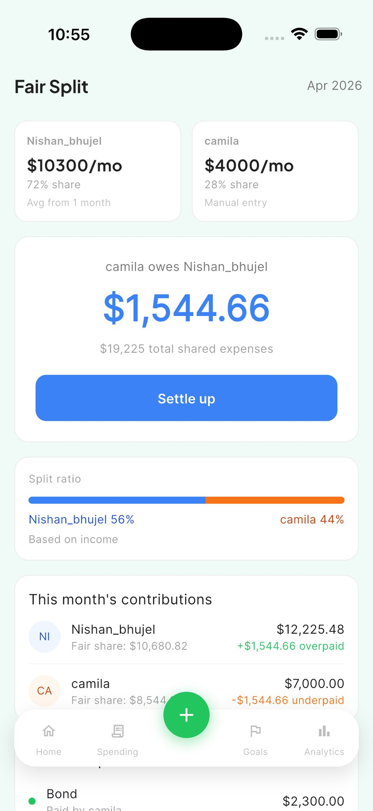
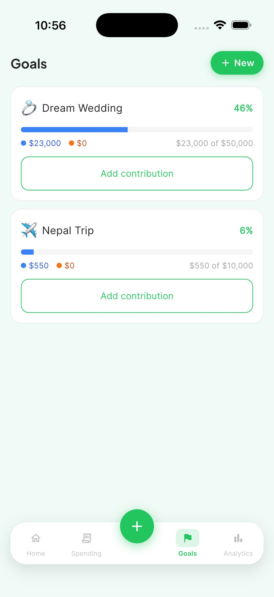
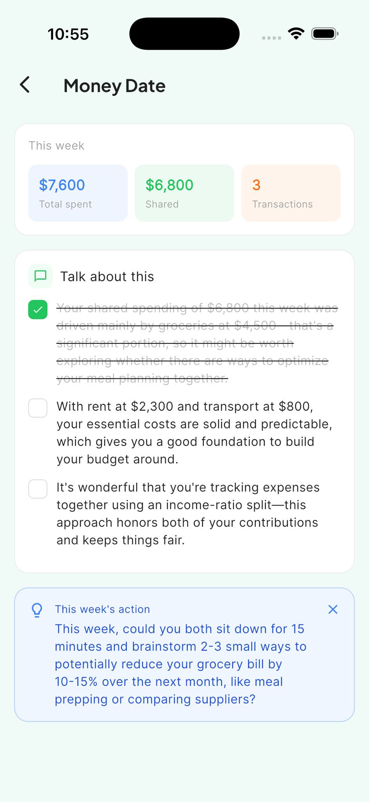
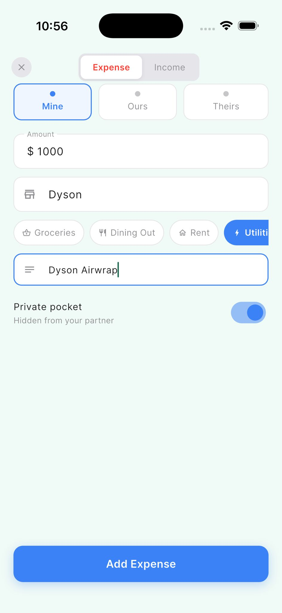

TwoWallet is a Flutter couples-finance app currently live on Google Play internal testing and TestFlight. Built solo, end-to-end, using Supabase, Riverpod, RevenueCat, PostHog, and the Anthropic Claude API.

